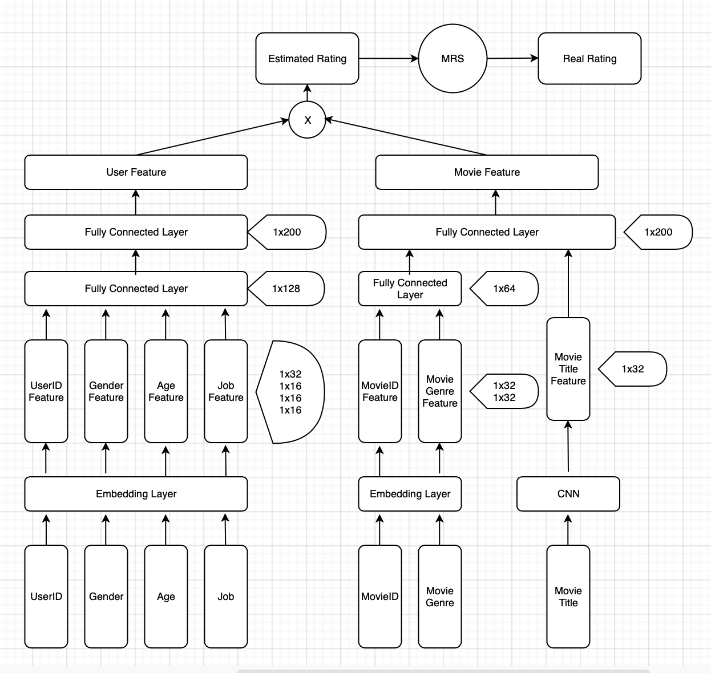

# Movie-Recommender-System

## Background

Generally, recommender systems are algorithms aimed at suggesting relevant items to targets. To achieve this, there are two major ways: **collaboratrive filtering** and **content based** methods.

**Collaboratrive Filtering** method is based solely on the past interactions recorded between users and items in order to produce new recommendations. The main advantange is that it requires no information about users or items. Moreover, the more users interact with items the more new recommendations become accurate. However, as it only consider past interactions to make recommendations, collaborative filtering suffers from the **cold start problem**, which is impossible to recommend anything to new users or to recommend a new item to any users.

## Architecture

As observed, some of fields are described by words which can not be recognized or processed easily by computers. Usually, **One Hot Encoding** is widely used.

>>**One Hot Encoding** can be applied to the integer representation. This is where the integer encoded variable is removed and a new binary variable is added for each unique integer value.

However, some fields like **UserID** and **MovieID** will become very sparse after one-hot encoding and the input dimension will become large dramatically. To solve this, the embedding layer is used as the first layer of the network.

The movie recommender system model is deigned as follows:

## Implementation

### Data Preprocessing

### Model Design

#### Parameters

#### Hyperparameters

#### Create Input Function

#### Build Neural Network

#### Build Graph

### Train, Evaluate and Predict