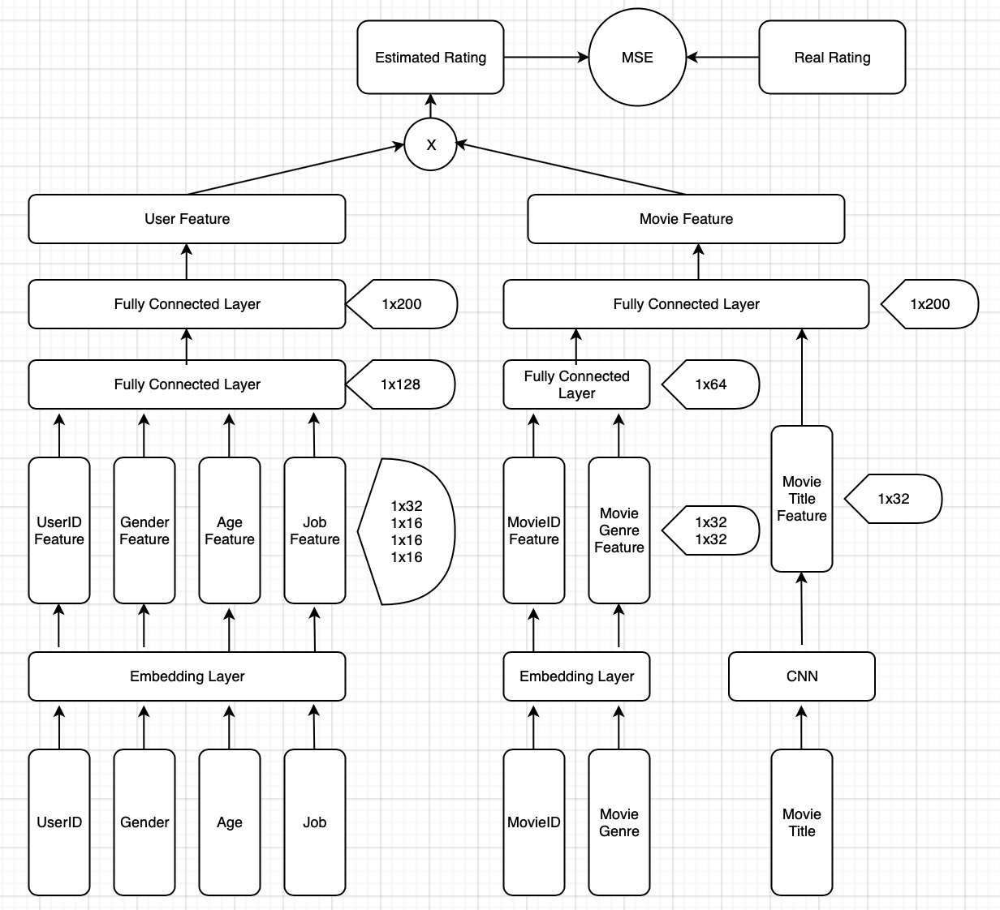

# Movie-Recommender-System

[toc]

## Background

Generally, recommender systems are algorithms aimed at suggesting relevant items to targets. To achieve this, there are two major ways: **collaboratrive filtering** and **content based** methods.

**Collaboratrive Filtering** method is based solely on the past interactions recorded between users and items in order to produce new recommendations. The main advantange is that it requires no information about users or items. Moreover, the more users interact with items the more new recommendations become accurate. However, as it only consider past interactions to make recommendations, collaborative filtering suffers from the **cold start problem**, which is impossible to recommend anything to new users or to recommend a new item to any users.

By the way, the solution to solve the cold start problem is to ask users to select their interested topics, groups and favorite movies etc. when they register at the first time.

## Better Understanding of Convolutional Neural Networks for NLP

1. [Convolutional Neural Networks for Sentence Classification]{https://www.aclweb.org/anthology/D14-1181.pdf}
2. [Understanding Convolutional Neural Networks for NLP]{http://www.wildml.com/2015/11/understanding-convolutional-neural-networks-for-nlp/}

## Architecture

As observed, some of fields are described by words which can not be recognized or processed easily by computers. Usually, **One Hot Encoding** is widely used.

>**One Hot Encoding** can be applied to the integer representation. This is where the integer encoded variable is removed and a new binary variable is added for each unique integer value.

However, some fields like **UserID** and **MovieID** will become very sparse after one-hot encoding and the input dimension will become large dramatically. To solve this, the embedding layer is used as the first layer of the network.

The movie recommender system model is deigned as follows:

## Application

The basic idea is about **Cosine Similarity**

### Recommend movies with same genre

The ides is to

1. Compute the cosine similarity of the given movie and the whole movies' feature matrix
2. Return top k max similarity values
3. Select randomly to make sure each recommendation id distinct

Here is how the result looks like:

### Recommend movies you may like

The ides is to

1. Compute the cosine similarity of the given user and the whole movies' feature matrix
2. Return top k max similarity values
3. Select randomly to make sure each recommendation id distinct

Here is how the result looks like:

### Recommend other favorite movies according to the given movie

The ides is to

1. Select top k users who like the given movie in order to obtain their feature matrix
2. Calculate rating of all movies given by these users
3. Recommend movies with highest ratings
4. Select movies with same ratings randomly

